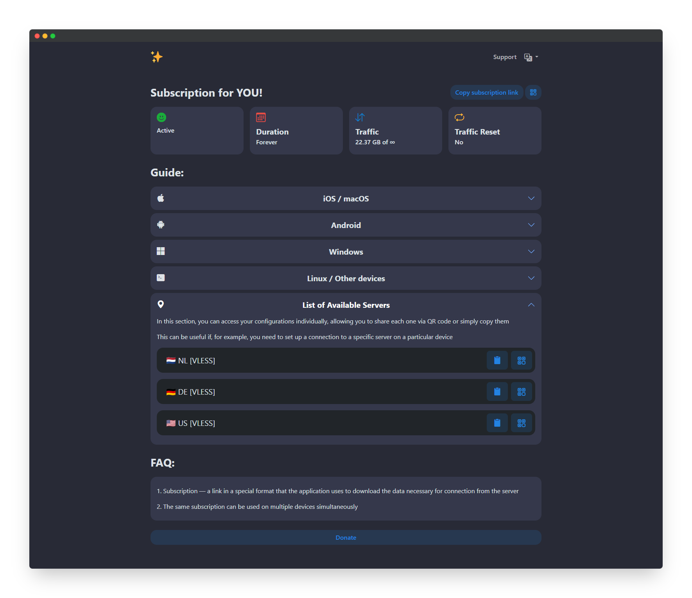

<h3 align="center">Marzbanner - Marzban subscription page template</h3>

<p align="center">
  Simple, beautiful, and user-friendly HTML template for <a href="https://github.com/Gozargah/Marzban">Marzban</a> and <a href="https://github.com/marzneshin/marzneshin">Marzneshin</a> subscription page based on Bootstrap CSS framework
  <br>
  <br>
  <a href="https://streletskiy.github.io/marzban-sub-page/"><strong>Live demo »</strong></a>
  <br>
  <br>
  <a href="https://github.com/streletskiy/marzban-sub-page/tree/main#features">Features</a>
  ·
  <a href="https://github.com/streletskiy/marzban-sub-page/tree/main#installation">Installation</a>
  ·
  <a href="https://github.com/streletskiy/marzban-sub-page/tree/main#personalization">Personalization</a>
</p>

<p>
  <picture>
    
  </picture>
</p>

# Features

- The design is simple and intuitive.
- The code is minimal and with comments for easy editing.
- Language switching: English, Russian (Русский), Chinese (中文) and Persian (فارسی).
- Automatic detection of the user's language.
- QR code with subscription link.
- Separate links and QR codes for each node, display name for each connection (including emoji symbols in all browsers).
- Detailed guides are provided for Windows, Android, iOS, MacOS and Linux.

# Installation

<h2>Marzban:</h2>
Use the instruction below to install page to <a href="https://github.com/Gozargah/Marzban">Marzban</a>
<h3>Install:</h3>

1. Upload the file to the server.
```
sudo wget -N -P /var/lib/marzban/templates/subscription/ https://raw.githubusercontent.com/streletskiy/marzban-sub-page/main/index.html
```
2. Enter these commands to automatically specify the file path to the subscription page.
```
echo 'CUSTOM_TEMPLATES_DIRECTORY="/var/lib/marzban/templates/"' | sudo tee -a /opt/marzban/.env
echo 'SUBSCRIPTION_PAGE_TEMPLATE="subscription/index.html"' | sudo tee -a /opt/marzban/.env
```
Or specify them manually by editing the Marzban `.env` file.
```
CUSTOM_TEMPLATES_DIRECTORY="/var/lib/marzban/templates/"
SUBSCRIPTION_PAGE_TEMPLATE="subscription/index.html"
```
3. Restart Marzban to apply the changes.
```
marzban restart
```
<h3>Update:</h3>
Re-upload the page file to the server (re-do first step from install):

```
sudo wget -N -P /var/lib/marzban/templates/subscription/ https://raw.githubusercontent.com/streletskiy/marzban-sub-page/main/index.html
```
After update need to repeat personalization.

<h2>Marzneshin:</h2>
Use the instruction below to install page to <a href="https://github.com/marzneshin/marzneshin">Marzneshin</a>
<h3>Install:</h3>

1. Upload the file to the server.
```
sudo wget -N -P /var/lib/marzneshin/templates/subscription/ https://raw.githubusercontent.com/streletskiy/marzban-sub-page/main/marzneshin/index.html
```
2. Enter these commands to automatically specify the file path to the subscription page.
```
echo 'CUSTOM_TEMPLATES_DIRECTORY="/var/lib/marzneshin/templates/"' | sudo tee -a /etc/opt/marzneshin/.env
echo 'SUBSCRIPTION_PAGE_TEMPLATE="subscription/index.html"' | sudo tee -a /etc/opt/marzneshin/.env
```
Or specify them manually by editing the Marzneshin `.env` file.
```
CUSTOM_TEMPLATES_DIRECTORY="/var/lib/marzneshin/templates/"
SUBSCRIPTION_PAGE_TEMPLATE="subscription/index.html"
```
3. Restart Marzneshin to apply the changes.
```
marzneshin restart
```
<h3>Update:</h3>
Re-upload the page file to the server (re-do first step from install):

```
sudo wget -N -P /var/lib/marzneshin/templates/subscription/ https://raw.githubusercontent.com/streletskiy/marzban-sub-page/main/marzneshin/index.html
```
After update need to repeat personalization.

# Personalization

To customize the favicons, logo, support and donate links, you need to edit the `index.html` file. Replace the following default values with your own.

Favicons:
```
https://raw.githubusercontent.com/streletskiy/marzban-sub-page/refs/heads/main/img/apple-touch-icon.png
https://raw.githubusercontent.com/streletskiy/marzban-sub-page/refs/heads/main/img/favicon-16x16.png
https://raw.githubusercontent.com/streletskiy/marzban-sub-page/refs/heads/main/img/favicon-32x32.png
```
Support link:
```
https://t.me/gozargah_marzban
```
Donate link:
```
https://github.com/Gozargah/Marzban#donation
```
Logo:
```
https://raw.githubusercontent.com/streletskiy/marzban-sub-page/refs/heads/main/img/logo.png
```

## Hide Username
If you don't need to display the username, you can replace the subscription title.
Simply find this line in the file:
```
<span class="text-break fs-3 fw-bold me-auto"><span x-text="$t('subscriptionFor')"></span> {{ user.username }}</span>
```
and replace it with:
```
<span class="text-break fs-3 fw-bold me-auto" x-text="$t('subscription')"></span>
```

After making changes, save the file and restart Marzban / Marzneshin.

***
<p align="center">
  <br>
  Based on deeply rewrited <a href="https://github.com/dermv/marzbanify-template">dermw Marzbanify Template</a>
  <br>
</p>
