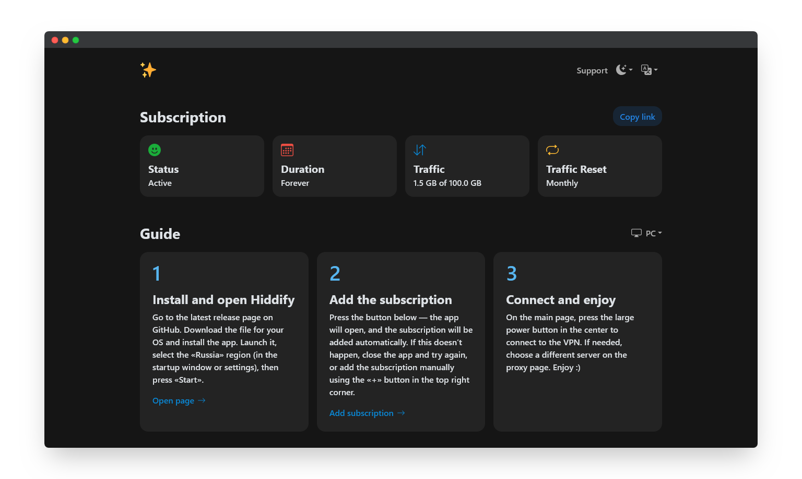

<h3 align="center">Marzbanify Template</h3>

<p align="center">
  Simple, beautiful, and user-friendly HTML template for <a href="https://github.com/Gozargah/Marzban">Marzban</a> subscription page
  <br>
  <a href="https://denisromanov.ru/projects/marzbanify-template-demo"><strong>Live demo »</strong></a>
  <br>
  <br>
  <a href="https://github.com/dermv/marzbanify-template/tree/main#features">Features</a>
  ·
  <a href="https://github.com/dermv/marzbanify-template/tree/main#installation">Installation</a>
  ·
  <a href="https://github.com/dermv/marzbanify-template/tree/main#personalization">Personalization</a>
</p>

<p>
  <picture>
    <source media="(prefers-color-scheme: dark)" srcset="./.github/assets/dark.png">
    <source media="(prefers-color-scheme: light)" srcset="./.github/assets/light.png">
    
  </picture>
</p>

# Features

- The design is simple and intuitive, with minimal code.
- Theme switching: system, light, and dark modes.
- Language switching: English and Russian.
- Guides are provided for PC, Android, and iOS.
- Automatic detection of the user's theme, language, and device.

# Installation

1. Upload the file to the server.
```
sudo wget -O /var/lib/marzban/templates/subscription/index.html https://raw.githubusercontent.com/dermv/marzbanify-template/main/index.html
```
2. Enter these commands to automatically specify the file path to the subscription page.
```
echo 'CUSTOM_TEMPLATES_DIRECTORY="/var/lib/marzban/templates/"' | sudo tee -a /opt/marzban/.env
echo 'SUBSCRIPTION_PAGE_TEMPLATE="subscription/index.html"' | sudo tee -a /opt/marzban/.env
```
Or specify them manually by editing the Marzban `.env` file.
```
CUSTOM_TEMPLATES_DIRECTORY="/var/lib/marzban/templates/"
SUBSCRIPTION_PAGE_TEMPLATE="subscription/index.html"
```
3. Restart Marzban to apply the changes.
```
marzban restart
```

## Host Version
To use the host version, upload the `sub` folder to the host and change the value of `BASE_URL` to your panel address in the `index.php` file just like the following example.
```
const BASE_URL = "https://example.com:port";
```

# Personalization

To customize the favicons, support link, and logo, you need to edit the `index.html` file. Replace the following default values with your own.

Favicons:
```
https://raw.githubusercontent.com/dermv/marzbanify-template/refs/heads/main/img/apple-touch-icon.png
https://raw.githubusercontent.com/dermv/marzbanify-template/refs/heads/main/img/favicon-16x16.png
https://raw.githubusercontent.com/dermv/marzbanify-template/refs/heads/main/img/favicon-32x32.png
```
Support link:
```
https://t.me/
```
Logo:
```
https://raw.githubusercontent.com/dermv/marzbanify-template/refs/heads/main/img/logo.png
```

## Displaying Username
If you need to display the username, you can replace the subscription title.
Simply find this line in the file:
```
<span class="fs-3 fw-bold me-auto" x-text="$t('subscription')"></span>
```
and replace it with:
```
<span class="text-break fs-3 fw-bold me-auto">{{ user.username }}</span>
```
For host version replace it with:
```
<span class="text-break fs-3 fw-bold me-auto"><?= $user['username'] ?></span>
```

After making changes, save the file and restart Marzban.
